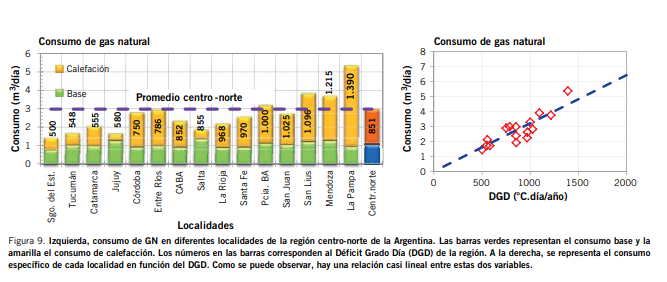

<h1 align= 'center'><strong>Consumo y producción de gas en Argentina</strong></h1>

# Indice
- [Introduccion](#Introduccion)
- [Objetivos](#Objetivos)
- [Producto](#Producto)

# Introduccion
Este repositorio contiene un análisis sobre los patreones de consumo y producción de gas natural por provincias y estación en Argentina desde enero de 2019 hasta diciembre de 2023 (incluído)
  

    
  

  
  ## Base teórica
El gas natural constituye el principal componente de la matriz energética nacional con el aporte de más del 50% de la energía primaria del país. Alrededor del 27% del gas se distribuye a través de redes a los usuarios residenciales.  Alrededor del 27% del gas se distribuye a través de redes a los usuarios residenciales. Datos promediados sobre el consumo residencial entre los años 2010 y 2015, muestran que el consumo en los meses de verano (enero y diciembre) coincide con el consumo base, es decir el consumo de gas usado en cocción y calentamiento de agua. En los meses correspondientes al invierno, el consumo en promedio es del 56% residencial teniendo un incremento de ±4% dedicado casi a la calefacción. Porcentaje que puede variar o no en función de la rigurosidad de los inviernos. Además existe una relación casi lineal entre los consumos de gas, en particular de los consumos de calefacción y el Déficit Grado Día (DGX) de cada localidad, sin embargo, hay algunas desviaciones de esta linealidad, como consecuencia de los niveles socioeconómicos de sus habitantes.

Los grados-día/calefacción (GDC) son una medida estadística que mide el frío o la temperatura de un lugar. Sirve para estimar cuanto se necesita para calentar o enfríar un edificio/residencia. Un grado-día compara la media (el promedio de las temperaturas máximas y mínimas) registradas en el exterior de un lugar con una temperatura estándar, generalmente 18 °C. 
Ejemplo: A modo de ejemplo utilizando la temp base= 18° y suponiendo que la temperatura de un día X es: Max 10°C, min 4°C, la media de ambas es de 7°C. Se aplica una fórmula  estadística, *(b)18-(m)7= 11 Grados día*, ese valor indica un mayor consumo.Luego cada valor resultante de cada día es sumado de acuerdo a un periodo de tiempo de interés (mes, temporada o año) y da como resultado el GDG anual.

    
    

Fuentes:
  - https://www.petrotecnia.com.ar/abril17/Petro/GasVsElec.pdf
  - https://www.camarco.org.ar/wp-content/uploads/2023/07/17-Gas.pdf
  - https://www.eia.gov/energyexplained/units-and-calculators/degree-days.php

# Objetivos
El objetivo principal es cuantificar y modelar cómo los factores climáticos influyen en el consumo de gas en los diferentes sectores. 
La motivación surge de la necesidad de comprender la estacionalidad de la demanda energética para optimizar la infraestructura de distribución y producción, especialmente ante los picos de consumo en estaciones y provincias frías.

# Producto
* [Informe EDA]()
* [Dasboard]()
